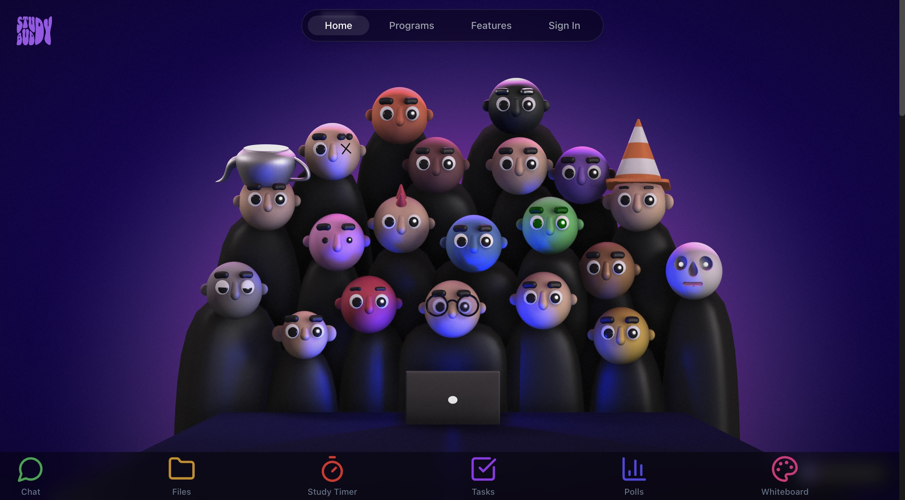

# Study Buddy: Revolutionizing Collaborative Learning 🚀

<div align="center">
  
  
  [](https://react.dev/)
  [](https://www.typescriptlang.org/)
  [](https://tailwindcss.com/)
  [](https://firebase.google.com/)
  [](https://www.netlify.com/)
</div>

## 🌟 Our Vision

**Transforming Learning Together** - Study Buddy is more than just an app; it's a collaborative learning ecosystem designed to make studying engaging, efficient, and enjoyable. From group study sessions to real-time collaboration, we're revolutionizing how students learn and interact.

## 🎯 Key Features

### 🤝 Collaborative Learning
- **Real-time Study Rooms**: Create and join study groups
- **Collaborative Notes**: Shared note-taking with real-time updates
- **Group Discussions**: Chat and communicate while studying

### 🕒 Productivity Tools
- **Study Timer**: Pomodoro-style time management
- **Task Manager**: Track and manage your study tasks
- **Poll System**: Create quick polls for group decision-making

### 🎥 Interactive Features
- **Video Call Integration**: Seamless video communication
- **YouTube Watch Together**: Synchronize video watching
- **Whiteboard**: Collaborative drawing and brainstorming

## 🚀 Tech Stack

- **Frontend**: React 19, TypeScript, Tailwind CSS
- **Backend**: Firebase Authentication and Firestore
- **Deployment**: Netlify
- **State Management**: React Contexts
- **UI Components**: Shadcn/ui

## 🏗️ Project Structure

```
study-buddy/
├── frontend/
│   ├── src/
│   │   ├── components/
│   │   ├── contexts/
│   │   ├── hooks/
│   │   ├── pages/
│   │   └── services/
├── backend/
│   └── firebase/
└── README.md
```

## 🎮 Quick Start

### Prerequisites
- Node.js (v18+)
- npm or bun
- Firebase Account

### Installation

1. Clone the repository
```bash
git clone https://github.com/your-username/study-buddy.git
cd study-buddy
```

2. Install dependencies
```bash
cd frontend
npm install  # or bun install
```

3. Set up Firebase
- Create a Firebase project
- Add your Firebase configuration to `src/lib/firebase.ts`

4. Run the development server
```bash
npm run dev  # or bun run dev
```

## 🤝 Contributing

Contributions are welcome! Please feel free to submit a Pull Request.

1. Fork the repository
2. Create your feature branch (`git checkout -b feature/AmazingFeature`)
3. Commit your changes (`git commit -m 'Add some AmazingFeature'`)
4. Push to the branch (`git push origin feature/AmazingFeature`)
5. Open a Pull Request


## 🌐 Contact

Project Link: [https://studybuddy08.netlify.app/](https://studybuddy08.netlify.app/)

---

<div align="center">
  <b>Built with ❤️ by the Study Buddy Team</b><br>
  
</div> 
